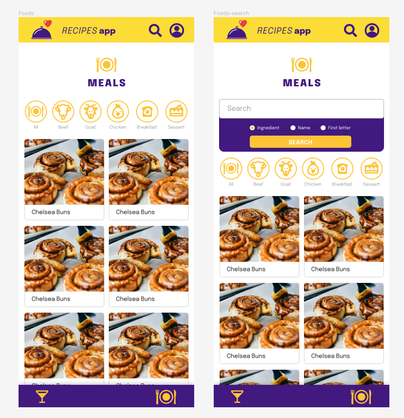
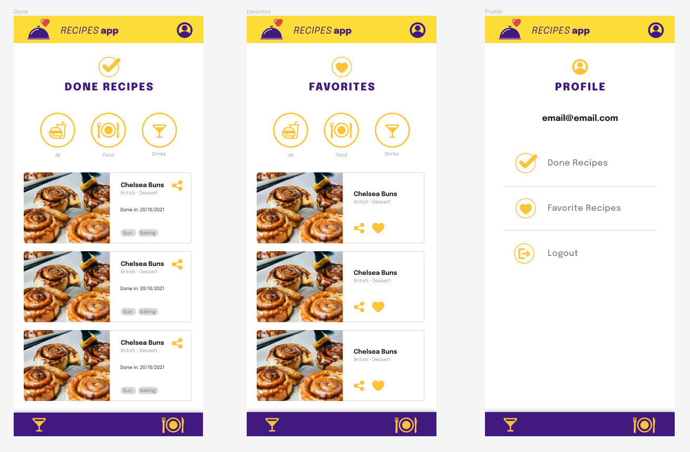

# :sparkles: Project Recipes App

This project is a web recipe app that uses React Hooks and Context API. It was developed as a group project, using agile methodologies (scrum and kanban), as the final challenge of the front-end module at [Trybe](https://betrybe.com).

## Summary

- [About the project](#about-the-project)
  - [Context](#man_technologist-contexto)
  - [Schedule](#schedule)
  - [Features](#features)
  - [Demo](#demo)
- [Technologies used](#technologies-used)  
  - [Front-end](#front-end)  
  - [Tests](#tests)  
- [APIs](#gear-apis)
- [Installation](#installing-the-project-locally)
  - [Running tests](#running-coverage-tests)
- [Project requirements](#project-requirements)
- [Development status](#development-status)
  - [Development challenges](#development-challenges)
- [Developers](#developers)
- [Acknowledgments](#acknowledgments)

<br/>

# About the project

## :man_technologist: Context

Our challenge in this project was to develop the ReactJS interface for a system that allows users to view, search, filter, favorite, share, and track the preparation process for recipes and drinks. The database consists of two separate APIs, one for food and another for drinks.

## Project deadline

The sprint lasted for 9 days in December 2022.

## Features

- Search for recipes by ingredient, name, or first letter;
- Explore recipes by category, origin, or surprise;
- Access the details of each recipe, including ingredients, instructions, and video;
- Start, pause, and finish the preparation of a recipe;
- Favorite and unfavorite recipes;
- Share recipes on social media;
- Access the user profile with favorite and completed recipes.

## Demo

Deploy: <a href="https://recipes-app-jaider.vercel.app/" target="_blank">Recipes App</a>
<br />

<br />
<a href="https://www.figma.com/file/9WXNFMewKRBC5ZawU1EXYG/%5BProjeto%5D%5BFrontend%5D-Recipes-App?node-id=0%3A1&t=flL48tUQI6vmnPEY-1" target="_blank">Figma:</a>
<br />



<p align="right"><a href="#sparkles-project-recipes-app">(Back to top)</a></p>

## Technologies used

### Front-end
- HTML
- CSS
- JavaScript
- React
- React Router
- React Hooks
- Context API
- clipboard-copy library
### Tests
- Jest
- React Testing Library

## :gear: APIs

Requests were made using only `fetch`, as instructed to avoid conflicts with requirements evaluation.

* <details><summary><b>TheMealDB API</b></summary>

    [The Meal DB](https://www.themealdb.com/) is a community-maintained open database of recipes and ingredients from all over the world.

    The endpoints are quite rich, you can [see them here](https://www.themealdb.com/api.php).

    The response model for a `meal` is as follows:
      
    <details><summary><b>See response model for a meal</b></summary>
    ```json
      {
        "meals":[
          {
            "idMeal":"52882",
            "strMeal":"Three Fish Pie",
            "strDrinkAlternate":null,
            "strCategory":"Seafood",
            "strArea":"British",
            "strInstructions":"Preheat the oven to 200C\/400F\/Gas 6 (180C fan).\r\nPut the potatoes into a saucepan of cold salted water. Bring up to the boil and simmer until completely tender. Drain well and then mash with the butter and milk. Add pepper and taste to check the seasoning. Add salt and more pepper if necessary.\r\nFor the fish filling, melt the butter in a saucepan, add the leeks and stir over the heat. Cover with a lid and simmer gently for 10 minutes, or until soft. Measure the flour into a small bowl. Add the wine and whisk together until smooth.\r\nAdd the milk to the leeks, bring to the boil and then add the wine mixture. Stir briskly until thickened. Season and add the parsley and fish. Stir over the heat for two minutes, then spoon into an ovenproof casserole. Scatter over the eggs. Allow to cool until firm.\r\nSpoon the mashed potatoes over the fish mixture and mark with a fork. Sprinkle with cheese.\r\nBake for 30-40 minutes, or until lightly golden-brown on top and bubbling around the edges.",
            "strMealThumb":"https:\/\/www.themealdb.com\/images\/media\/meals\/spswqs1511558697.jpg",
            "strTags":"Fish,Seafood,Dairy,Pie",
            "strYoutube":"https:\/\/www.youtube.com\/watch?v=Ds1Jb8H5Sg8",
            "strIngredient1":"Potatoes",
            "strIngredient2":"Butter",
            "strIngredient3":"Milk",
            "strIngredient4":"Gruy\u00e8re",
            "strIngredient5":"Butter",
            "strIngredient6":"Leek",
            "strIngredient7":"Plain Flour",
            "strIngredient8":"White Wine",
            "strIngredient9":"Milk",
            "strIngredient10":"Parsley",
            "strIngredient11":"Salmon",
            "strIngredient12":"Haddock",
            "strIngredient13":"Smoked Haddock",
            "strIngredient14":"Eggs",
            "strIngredient15":"",
            "strIngredient16":"",
            "strIngredient17":"",
            "strIngredient18":"",
            "strIngredient19":"",
            "strIngredient20":"",
            "strMeasure1":"1kg",
            "strMeasure2":"Knob",
            "strMeasure3":"Dash",
            "strMeasure4":"50g",
            "strMeasure5":"75g",
            "strMeasure6":"2 sliced",
            "strMeasure7":"75g",
            "strMeasure8":"150ml",
            "strMeasure9":"568ml",
            "strMeasure10":"2 tbs chopped",
            "strMeasure11":"250g",
            "strMeasure12":"250g",
            "strMeasure13":"250g",
            "strMeasure14":"6",
            "strMeasure15":"",
            "strMeasure16":"",
            "strMeasure17":"",
            "strMeasure18":"",
            "strMeasure19":"",
            "strMeasure20":"",
            "strSource":"https:\/\/www.bbc.co.uk\/food\/recipes\/three_fish_pie_58875",
            "dateModified":null
          }
        ]
      }
    ```
  </details>

  The ingredients follow a logical order where their name (<code>strIngredient1</code>) and quantity (<code>strMeasure1</code>) have the same number at the end (1, in this case).

  It is possible to list all `categories`, `nationalities` (referred to as "areas" in the API), and `ingredients`:

  ```json
  categories: https://www.themealdb.com/api/json/v1/1/list.php?c=list
  nationalities: https://www.themealdb.com/api/json/v1/1/list.php?a=list
  ingredients: https://www.themealdb.com/api/json/v1/1/list.php?i=list
  ```

  The ingredient photos come from a standardized endpoint with the following logic:
  ```
  https://www.themealdb.com/images/ingredients/${ingredient-name}-Small.png  

  // Example with "Lime":
  https://www.themealdb.com/images/ingredients/Lime-Small.png
  ```
  </details>
    

* <details><summary><b>The CocktailDB API</b></summary>
  Quite similar (in fact, maintained by the same entity) to TheMealDB API, but focused on drinks.

  The endpoints are also quite rich, and you can [see them here](https://www.thecocktaildb.com/api.php).

  The responses follow the same structure, with some specifics related to drinks (such as being alcoholic or not, for example).

    <details><summary><b>See response model for drinks</b></summary>
    ```json
        {
          "drinks":[
              {
                "idDrink":"17256",
                "strDrink":"Martinez 2",
                "strDrinkAlternate":null,
                "strDrinkES":null,
                "strDrinkDE":null,
                "strDrinkFR":null,
                "strDrinkZH-HANS":null,
                "strDrinkZH-HANT":null,
                "strTags":null,
                "strVideo":null,
                "strCategory":"Cocktail",
                "strIBA":null,
                "strAlcoholic":"Alcoholic",
                "strGlass":"Cocktail glass",
                "strInstructions":"Add all ingredients to a mixing glass and fill with ice.\r\n\r\nStir until chilled, and strain into a chilled coupe glass.",
                "strInstructionsES":null,
                "strInstructionsDE":"Alle Zutaten in ein Mischglas geben und mit Eis f\u00fcllen. Bis zum Abk\u00fchlen umr\u00fchren und in ein gek\u00fchltes Coup\u00e9glas abseihen.",
                "strInstructionsFR":null,
                "strInstructionsZH-HANS":null,
                "strInstructionsZH-HANT":null,
                "strDrinkThumb":"https:\/\/www.thecocktaildb.com\/images\/media\/drink\/fs6kiq1513708455.jpg",
                "strIngredient1":"Gin",
                "strIngredient2":"Sweet Vermouth",
                "strIngredient3":"Maraschino Liqueur",
                "strIngredient4":"Angostura Bitters",
                "strIngredient5":null,
                "strIngredient6":null,
                "strIngredient7":null,
                "strIngredient8":null,
                "strIngredient9":null,
                "strIngredient10":null,
                "strIngredient11":null,
                "strIngredient12":null,
                "strIngredient13":null,
                "strIngredient14":null,
                "strIngredient15":null,
                "strMeasure1":"1 1\/2 oz",
                "strMeasure2":"1 1\/2 oz",
                "strMeasure3":"1 tsp",
                "strMeasure4":"2 dashes",
                "strMeasure5":null,
                "strMeasure6":null,
                "strMeasure7":null,
                "strMeasure8":null,
                "strMeasure9":null,
                "strMeasure10":null,
                "strMeasure11":null,
                "strMeasure12":null,
                "strMeasure13":null,
                "strMeasure14":null,
                "strMeasure15":null,
                "strCreativeCommonsConfirmed":"No",
                "dateModified":"2017-12-19 18:34:15"
              }
          ]
        }
      ```
  </details>
    
    The ingredients follow a logical order where its name (<code>strIngredient1</code>) and quantity (<code>strMeasure1</code>) have the same number at the end (1 in this case).
  
</details>

  <p align="right"><a href="#sparkles-project-recipes-app">(Back to top)</a></p>

## Installing the project locally

To install the project locally, follow these steps:

1. Clone the repository
```sh
git clone git@github.com:jaidernunes/recipes-app.git
```
2. Enter the project folder
```sh
cd app-receitas
```
3. Install dependencies
```sh
 npm install
```
4. Start the local server
```sh
 npm start
```
- ### Running coverage tests
It's possible to check the test coverage percentage with the command
```sh
npm run test-coverage
```

<p align="right"><a href="#sparkles-project-recipes-app">(Back to top)</a></p>

## Project Requirements

> *Click on the arrow to see the list of requirements we received to develop during the evaluation process.*

We used the Kanban board on Trello to keep track of team progress.

<details><summary><strong>Login Screen</strong></summary> 
  1. Create all elements that should respect the attributes described in the prototype for the login screen.
  2. Develop the screen so that the person can enter their email in the email input and their password in the password input.
  3. Develop the screen so that the form is only valid after a valid email and a password of more than 6 characters have been entered.
  4. After submitting the form, save the user's email in the `user` key in localStorage.
  5. Redirect the user to the main food recipe screen after successful login submission and validation.
</details>

<details><summary><strong>Main food recipe screen</strong></summary> 
  6. Implement the header according to the needs of each screen.
  7. Redirect the user to the profile screen when clicking on the profile button.
  8. Develop the search button so that when clicked, the search bar should appear. It should work the same way to hide it.
  9. Implement the search bar elements respecting the attributes described in the prototype.
  10. Implement 3 radio buttons in the search bar: Ingredient, Name and First letter.
  11. Search the food API if the person is on the food page, and the drink API if they are on the drink page.
  12. If the search returns more than one recipe, render the first 12 found, displaying the image and name of each.
  13. Implement the bottom menu positioning it in a fixed way and containing 2 icons: one for food and one for drinks.
  14. Display the bottom menu only on the screens indicated in the prototype.
  15. Redirect the user to the correct screen when clicking on each icon in the bottom menu.
  16. Load the first 12 food or drink recipes, one on each card.
  17. Implement the category buttons to be used as a filter.
  18. Implement the recipe filter through the API when clicking on the category filter.
  19. Implement the filter as a toggle, which if selected again, the app should return the recipes without any filter.
  20. Redirect the user when clicking on the card to the details screen, which should change the route and contain the recipe id in the URL.
  21. Make a request to the API passing the `id` of the recipe that should be available in the URL parameters.
</details>

<details><summary><strong>Recipe details screen</strong></summary> 
  22. Develop the screen so that it contains a recipe image, title, category in case of food and whether or not it is alcoholic in case of drinks, a list of ingredients followed by quantities, instructions, an embedded youtube video, and recommendations.
  23. Implement recommendations. For food recipes, the recommendation should be for drinks, and for drink recipes, the recommendation should be for food.
  24. Implement the 6 recommendation cards, showing only 2. The scroll is horizontal, similar to a carousel.
  25. Develop a button named "Start Recipe" that should be fixed at the bottom of the screen at all times.
  26. Implement the solution so that if the recipe has already been made, the "Start Recipe" button disappears.
  27. Redirect the user if the "Start Recipe" button is clicked, the route should change to the recipe in progress screen.
</details>

<details><summary><strong>Recipe in progress screen</strong></summary> 
  28. Develop the screen to contain an image of the recipe, the title, the category in case of food and whether it is alcoholic or not in case of drinks, a list of ingredients with their respective quantities and instructions.
  29. Develop a checkbox for each item in the ingredients list.
  30. Save the progress state, which should be maintained if the person refreshes the page or goes back to the same recipe.
  31. Implement the solution so that the "Finish Recipe" button can only be enabled when all ingredients are checked.
</details>

<details><summary><strong>Screen for completed recipes</strong></summary> 
  32. Implement the elements of the screen for completed recipes respecting the attributes described in the prototype.
  33. Develop the screen so that, if the recipe on the card is a food, it must have: the photo of the recipe, name, category, nationality, the date on which the person made the recipe, the 2 first tags returned by the API, and a share button.
  34. Develop the screen so that, if the recipe on the card is a drink, it must have: the photo of the recipe, the name, whether it is alcoholic, the date on which the person made the recipe, and a share button.
  35. Develop the solution so that the share button must copy the URL of the recipe details screen to the clipboard.
  36. Implement 2 buttons that filter recipes by food or drink, and a third button that removes all filters.
  37. Redirect to the recipe details screen when the recipe's photo or name is clicked.
</details>

<details><summary><strong>Screen for favorite recipes</strong></summary>

  38. Implement the elements of the screen for favorite recipes (cumulative with the attributes in common with the screen for completed recipes), respecting the attributes described in the  prototype.
  39. Develop the screen so that, if the recipe on the card is a food, it must have: the photo of the recipe, name, category, nationality, a share button, and an "unfavorite" button.  
  40. Develop the screen so that, if the recipe on the card is a drink, it must have: the photo of the recipe, name, whether it is alcoholic or not, a share button, and an "unfavorite" butt on.
  41. Develop the solution so that the share button must copy the URL of the recipe details screen to the clipboard.
  42. Develop the solution so that the "unfavorite" button must remove the recipe from the favorite recipes list in the `localStorage` and from the screen.
  43. Implement 2 buttons that filter recipes by food or drink, and a third button that removes all filters.
  44. Redirect the user when the recipe's photo or name is clicked, and the route should change to the details screen for that recipe.
</details>

<details><summary><strong>User profile screen</strong></summary>

  45. Implement the elements of the profile screen respecting the attributes described in the prototype.
  46. Implement the solution so that the user's email must be visible.
  47. Implement 3 buttons: one named "Done Recipes," one named "Favorite Recipes," and one named "Logout."
  48. Redirect the user when the "Done Recipes" button is clicked, and the route should change to the screen for completed recipes.
  49. Redirect the user when the "Favorite Recipes" button is clicked, and the route should change to the screen for favorite recipes.
  50. Redirect the user when the "Logout" button is clicked, the `localStorage` should be cleared, and the route should change to the login screen.
</details>

<p align="right"><a href="#sparkles-project-recipes-app">(Back to top)</a></p>

## Development status

The project was delivered as expected, however it still needs some improvements in styling and some functionalities can be enhanced, such as: implementing a funcional carousel of recommended drinks for each dish and a return button.

### Development challenges

It was up to the group to define the development priorities of the requirements, requiring us to analyze the application as a whole, its different screens and components, and predict possible conflicts and/or component reuse. However, we still faced some refactoring needs to ensure cleaner code.

## Developers

<table>
  <tr>
    <td align="center">
      <a href="https://github.com/jaidernunes" target="_blank">
        
      </a>
      <a href="https://linkedin.com/in/jaidernunes" target="_blank">
        <p>:information_source: Jaider Nunes</p>
      </a>
    </td>
    <td align="center">
      <a href="https://github.com/joanamds" target="_blank">
        
        <p>Joana Santos</p>
      </a>
    </td>
    <td align="center">
      <a href="https://github.com/mateusmsf94" target="_blank">
        
        <p>Mateus Melo</p>
      </a>
    </td>
    <td align="center">
      <a href="https://github.com/priscilaSartori" target="_blank">
        
        <p>Priscilla Sartori</p>
      </a>
    </td>
    <td align="center">
      <a href="https://github.com/trybe-tech-ops" target="_blank">
        
        <p>Trybe</p>
      </a>
    </td>
  </tr>
</table>

## Acknowledgements

I thank Trybe for providing us with this opportunity for learning and developing technical and teamwork skills. I also thank my teammates for the exchanges, the instructors and mentors who supported and guided us during the project.

<p align="right"><a href="#sparkles-project-recipes-app">(Back to top)</a></p>
